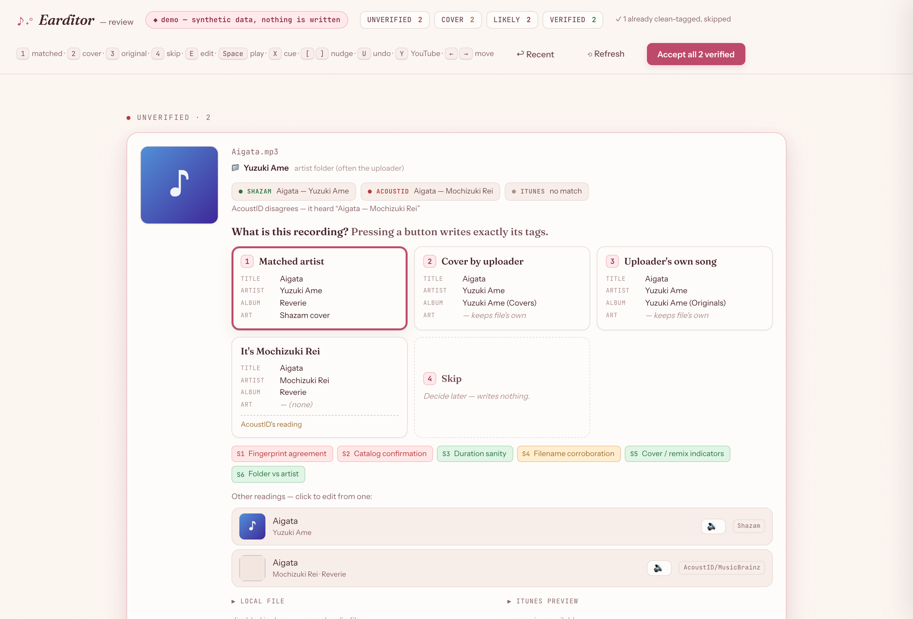

# Earditor

**The auditor for your music library. Metadata backed by evidence.**


Every music tagger will happily guess. Earditor won't. It listens to your files,
gathers evidence from independent sources, scores it deterministically, and tells
you exactly which metadata it can prove — and which it can't. **Proof, not guesses.**


## Download or run from source

Earditor remains local by design, but it does not have to *feel* like a localhost
project. The distributable build is a native **Earditor.app**: a normal macOS window
and Dock app wrapping the same review engine. The loopback server is an internal
implementation detail; it never listens beyond `127.0.0.1`, and the database and
settings live in `~/Library/Application Support/Earditor` so app upgrades do not
replace them.

Tagged GitHub builds are produced by the **Build macOS app** workflow. Its unsigned
artifact is useful for smoke-testing; a public GitHub Release should use the
Developer ID–signed and notarized zip described in
[`packaging/PACKAGING.md`](packaging/PACKAGING.md), so Gatekeeper treats it like a
real downloaded Mac app. Running from source remains fully supported below.

## Try it in 60 seconds

No config, no API keys, no music of your own. `--demo` loads a small **synthetic**
sample library — fictional uploaders and songs — so you can click through the entire
review experience with zero setup:

```bash
git clone https://github.com/ssskay/earditor.git
cd earditor
python3 -m venv .venv && source .venv/bin/activate   # keeps macOS's system Python untouched
pip install -r requirements-demo.txt                 # no fingerprinting deps or fpcalc
python3 review.py --demo                             # opens http://127.0.0.1:5001
```



In demo mode nothing is written to disk or to Music.app — accepting a track just
advances the queue. Every tier is represented, including the tricky ones.

> **Platforms.** Earditor scans, verifies, reviews, and tags your files on **macOS,
> Windows, and Linux**. The **Music.app integration is macOS-only** — elsewhere it runs
> files-only: accepting still writes tags and embeds cover art into the file itself, but
> nothing is added to a Music.app playlist. Full matrix in
> [docs/CONFIGURATION.md](docs/CONFIGURATION.md#platform-support).

## Who this is for

If you own your music as files, you own a metadata problem. Earditor is built for:

- **Collectors & audiophiles** — Bandcamp buys, vinyl rips, lossless archives — where
  "correct" is the whole point. Earditor's core rule is **blank beats wrong**: it never
  invents an album or borrows artwork it can't justify.
- **Self-hosters** (Plex / Jellyfin / Navidrome) staring down a 10k-file `Unknown Artist`
  folder. Triage retires the already-clean half of your library in about a minute,
  before a single API call.
- **DJs** whose libraries are full of edits and remixes that catalog-lookup taggers
  confidently mislabel.
- **Cover-heavy niches** — anime, vocaloid, utaite, nightcore, slowed+reverb,
  J-pop/K-pop covers. This is where every conventional tagger fails, because they
  assume the catalog answer is the right answer. Earditor treats "this is an uploader's
  cover, not the original" as a first-class outcome with its own verdict tier.

And instead of a black box, you get an audit: every file lands in a verdict tier
(**VERIFIED / LIKELY / COVER / UNVERIFIED / NO_MATCH**), so you always know how much
of your library you can actually trust — and the review queue shows you the raw
evidence for everything it couldn't prove.



*(Formerly known as Shazamer. Renamed because it grew from "run Shazam on my rips"
into an evidence engine that cross-examines Shazam as just one witness among several.)*

## Two phases

```
python3 scan.py      # headless: walk library → fingerprint → verify → SQLite
python3 review.py    # local web UI at http://127.0.0.1:5001 → accept/edit/skip
```

**Run `python3 scan.py --triage` once on a new library.** Roughly half of a real
library is already cleanly tagged and needs no identifying at all. Triage reads tags
only — no fingerprinting, no API calls, ~1 minute for 10k files — and retires those
files as `ALREADY_TAGGED`. Without it, `pending` counts every audio file you own and
wildly overstates the work left (10,022 → 5,260 on a real library).

Scanning is unattended and resumable (Ctrl-C safe; rerun continues from pending).
Accepting a track writes ID3 tags + embeds 1200×1200 art and adds it to the
`Earditor — Tagged` playlist in Music.app.

You don't have to drop to a terminal to scan: the review UI has a **Scan for more**
button (in the header and on the empty-queue state) that runs the same `scan.py`
pipeline as a background job, with a live progress indicator and queue counts that
update as tracks come in. It's guarded against double-triggering — one scan at a time.

## How verification works

For each file, evidence is gathered **independently** from Shazam (`shazamio`),
AcoustID+MusicBrainz (`pyacoustid`, an independent fingerprint), the iTunes Search
API (catalog + album + art + 30s preview + duration), and the file itself
(duration, folder = uploader, filename tokens). Then six signals are scored:

| Signal | Meaning |
|--------|---------|
| **S1** | AcoustID's independent fingerprint agrees with Shazam (anti "wrong song") |
| **S2** | iTunes catalog confirms this artist + title exists |
| **S3** | File duration matches the candidate (±10 % or ±15 s) |
| **S4** | Filename mentions the title **and** artist (romaji-aware: 夜に駆ける ↔ Yoru ni Kakeru) |
| **S5** | Cover/remix keywords (歌ってみた, nightcore, カバー, voicebank names…) — see `covers.py` |
| **S6** | Folder vs artist: match / neutral channel (Topic, VEVO…) / different artist |

### Verdict tiers (review queue is ordered worst-first)

- **UNVERIFIED** — signals conflict or nothing corroborates. **No proposed tags.** Candidates shown side-by-side; you pick or edit.
- **COVER** — cover keyword, or folder is a different artist while the title matches. Proposes title from Shazam, **artist = folder/uploader**, album blank. (Only when the title is trustworthy — a cover keyword on a wrong-song fingerprint falls to UNVERIFIED instead.)
- **LIKELY** — iTunes + duration + (filename or folder) agree, but no independent fingerprint agreement. Reviewed individually.
- **VERIFIED** — S1 **and** S3 pass with no cover flags, **or** an official "— Topic" channel confirms the artist. Eligible for one-click batch-accept. *(The S1 path uses a free AcoustID key — optional, see below; the Topic-channel path needs no key, so Shazam-only libraries still reach VERIFIED.)*
- **NO_MATCH** — no fingerprint anywhere. Recorded so it's never rescanned.

Album name and artwork always come from **iTunes** (canonical, 1200×1200) when the
artist+title are verified, falling back to Shazam. Never invents an album — blank
beats wrong.


## Setup

**Requirements:** **Python 3.10+**, and `fpcalc` from **Chromaprint** (only needed for
the optional AcoustID second fingerprint). macOS additionally gets the Music.app
integration; on Windows and Linux Earditor runs files-only.

```bash
brew install chromaprint             # macOS — provides fpcalc
# Windows: download Chromaprint and point $FPCALC at fpcalc.exe
# Linux:   apt install libchromaprint-tools

python3 -m venv .venv                 # isolated environment (recommended)
source .venv/bin/activate
pip install -r requirements.txt

cp config.example.json config.json   # then edit music_path for your machine
```

> Prefer not to use a venv? `pip3 install --user -r requirements.txt` also works.
> Avoid `--break-system-packages` unless you know you want it.

`config.json` holds your library path and is **gitignored** — it never leaves your
machine. Everything configurable lives there; nothing personal is hardcoded in the
source. If `config.json` is absent the app falls back to sensible defaults (`~/Music`
for the library path).

> 📖 **[docs/CONFIGURATION.md](docs/CONFIGURATION.md)** documents every config key and
> every `scan.py` flag, plus the `<Artist>/<Album>/track` layout Earditor expects, how
> to point it at a non-Music.app library, and how to narrow a scan with
> [path filters](docs/CONFIGURATION.md#path-filters).

### AcoustID API key — optional

**Earditor runs on Shazam alone.** AcoustID is an *optional second fingerprint* — an
independent Chromaprint → MusicBrainz lookup whose only job is to cross-check Shazam
and catch the rare "confidently wrong song." It powers the **S1** signal and unlocks
the **VERIFIED** tier's one-click batch-accept. It is **not** required to use Earditor.

**Without a key — Shazam-only.** The full pipeline still runs: Shazam + iTunes +
duration + filename + folder. Solid matches land in **LIKELY** (reviewed individually),
official "— Topic" channels still reach **VERIFIED**, and covers/re-uploads are still
detected. Make it explicit with:

```bash
python3 scan.py --no-acoustid
```

**With a key — recommended for large or obscure libraries.** A second independent
fingerprint lets whole swaths of your library reach **VERIFIED** and batch-accept in
one click — most worth it when you have thousands of files, or deep cuts Shazam
sometimes mishears. The key is **free** and **never written to disk** (read at runtime
from `$ACOUSTID_API_KEY` or the macOS Keychain, service `acoustid`). Get an
*application* key at <https://acoustid.org/new-application>, then:

```bash
security add-generic-password -s acoustid -a "$USER" -w <YOUR_KEY> -U
```

If a stored key is rejected, `scan.py` logs a loud warning and falls back to
Shazam-only for that run — nothing breaks.

## Usage

```bash
python3 scan.py --triage        # FIRST: retire already-tagged files (fast, no API calls)
python3 scan.py                 # scan all pending files
python3 scan.py --limit 10      # scan the next 10 (good for a first look)
python3 scan.py --queue-target 25   # scan until 25 tracks reach the review queue
python3 scan.py --files a.mp3   # scan specific files
python3 scan.py --no-acoustid   # Shazam-only: skip the optional AcoustID second fingerprint
python3 scan.py -v              # DEBUG logging (per-signal breakdown)
python3 review.py               # open the review UI

python3 migrate_v3.py           # import a prior version's exclude.csv as 'accepted'
python3 tests/test_verify.py    # unit tests for the signal/verdict logic

python3 refresh_artwork.py      # force Music.app to reload cover art for tagged tracks
python3 refresh_artwork.py --files a.mp3 b.m4a   # …or just specific files

python3 fix_cover_albums.py     # stamp album-less covers so they stop re-queuing
python3 fix_cover_albums.py --dry-run            # …preview what it would change
```

**Covers reappearing in the queue?** A cover is accepted with a blank album, and a
blank album fails the scan's "already tagged" check — so after Music.app relocates
the file, the next scan re-discovers it and re-queues it. Accepting a cover now
stamps a synthetic album from `cover_album_template` in config.json (default
`"{artist} (Covers)"`, e.g. `Ado (Covers)`) so it reads as fully tagged. For covers
tagged before that fix, run `python3 fix_cover_albums.py` — it only touches real
covers (artist reassigned away from the fingerprint), never legit album-less
originals.

**Cover art not updating in Music.app?** Music.app caches artwork in its own
library, and a plain tag `refresh` doesn't re-read it — so a freshly-tagged track
can keep showing its old cover. Accepting now pushes the new art into Music.app
directly, but for tracks tagged before that fix, run `python3 refresh_artwork.py`:
it re-pushes each Earditor-tagged track's embedded cover so the display updates.
It **skips uploader cover/original tracks** (album `… (Covers)` / `… (Originals)`),
which intentionally keep their own thumbnail rather than an Earditor-written cover.

Extra config keys: `original_album_template` (default `"{artist} (Originals)"`) stamps
an album on an uploader's original song so it reads as fully tagged; and
`stamp_cover_grouping` (default `true`) writes **Grouping = Cover** on catalog-verified
covers (option 1 with a cover keyword) so they're smart-playlist-able while keeping the
artist's real album and art.

### The review card — "what is this recording?"

Each card asks one question and answers it with **four always-present buttons**, and
every button shows the **exact final tags** it will write (Title / Artist / Album /
Art / Grouping) computed up-front — pressing a button writes exactly its preview, no
hidden transforms:


1. **Matched artist** — the identified catalog artist performed *this* recording
   (official uploads, re-uploads, and cover artists who have their own catalog
   releases). Tags come from the trusted source chain: iTunes when it matches the
   identified title+artist → else Shazam → else AcoustID. Never invents an album/art.
2. **Cover by uploader** — the uploader performed it and isn't in any catalog for it.
   Title per the trusted-title rule, artist = folder/uploader, album =
   `cover_album_template`, **no borrowed art** (keeps the file's own thumbnail).
3. **Uploader's own song** — an original work, undocumented anywhere. Title from the
   filename, artist = folder/uploader, album = `original_album_template`, no art.
4. **Skip** — decide later.

Above the buttons, a **source-agreement row** shows what Shazam / AcoustID / iTunes
each returned (`title — artist`), colour-coded green (agrees) / red (disagrees) /
amber (returned a *different* song) / grey (no result), with a one-line explanation
when they conflict. The verdict tier no longer changes what the buttons do — it only
**pre-highlights** the suggested one (VERIFIED/LIKELY → Matched, COVER → Cover). When
AcoustID names a different artist than Shazam, an extra **"It's {artist}"** button
resolves the disagreement in one click.

Review UI keyboard: **1** matched · **2** cover · **3** original · **4** skip (aliases
**A**/**C**/**O**/**S**) · **E** edit the highlighted option · **Space** play · **X**
cue local to preview · **[** **]** nudge ±5s · **U** undo last · **Y** copy + open
YouTube · **←/→** move. In edit mode, **Enter** saves and **Esc** cancels.

**Made a mistake?** Every accept/skip shows an **Undo** button in the toast, **U**
undoes the last one, and **↩ Recent** in the header lists the last 25 handled tracks
with an Undo on each. Undo puts the track back in the review queue (re-pointing it if
Music.app moved the file); re-accepting overwrites the tags with the corrected ones.

**Y** copies `{title} {artist}` and opens a YouTube search for it — using the candidate
match's artist even before you edit the fields, so cover/re-upload sources stay
identifiable by uploader. Or click **Scan for more** to pull in new rips without a terminal.

## Files

```
scan.py            CLI: walk → fingerprint → verify → SQLite
review.py          Flask review UI (+ applies tags on accept)
verify.py          signals S1–S6 + tier logic (pure, unit-tested)
covers.py          cover keyword / voicebank / neutral-channel data (easy to extend)
utils.py           normalization, romaji (pykakasi), filename/folder parsing, duration
sources/
  shazam.py        shazamio wrapper
  acoustid_mb.py   pyacoustid + MusicBrainz (independent fingerprint)
  itunes.py        iTunes search + preview + 1200×1200 art
tagger.py          ID3/MP4/FLAC tag + art embed (+ extract embedded art)
itunes_bridge.py   AppleScript: refresh + set artwork + add to Music.app playlist
refresh_artwork.py force Music.app to reload embedded cover art for tagged tracks
fix_cover_albums.py stamp a "covers" album on album-less covers (stops re-queuing)
db.py              SQLite layer + exclude.csv import helper
config.py          config.json loader + Keychain AcoustID key resolution
config.example.json  template config — copy to config.json (gitignored) and edit
migrate_v3.py      import legacy_accepted.csv (already done)
demo/              synthetic sample library for `review.py --demo` (fixtures + generator)
docs/assets/       README diagrams and demo screenshot (SVG / PNG)
tests/             unit tests
packaging/         native macOS .app wrapper (pywebview + py2app) — see PACKAGING.md
```

Local-only (gitignored, never committed): `config.json`, `earditor.db`, `demo.db`,
`logs/`, `legacy_accepted.csv` (the merged V1/V2/V3 processed list — machine-specific data).

## State & self-containment

Everything lives in `earditor.db` (`tracks` table). No more `exclude.csv` +
`last_index`. To start a scan over: `rm earditor.db && python3 migrate_v3.py`.
(Upgrading from Shazamer? The first run renames an existing `shazamer.db` to
`earditor.db` automatically — nothing is rescanned.) In the native app, state
lives outside the app bundle under
`~/Library/Application Support/Earditor`, so replacing the app cannot replace it.

**This folder is fully self-contained.** If you're migrating from an earlier version,
its "already-processed" list can be merged (deduped, absolute paths) into a local
`legacy_accepted.csv` and imported so those tracks are never rescanned; `migrate_v3.py`
defaults to that file, so re-running it after a DB reset re-applies them. That file is
machine-specific and gitignored.

## Privacy / public release

Nothing personal is hardcoded — the library path and all settings come from
`config.json`, which (along with `earditor.db`, `logs/`, and `legacy_accepted.csv`) is
gitignored. The AcoustID API key is never written to disk; it's read at runtime from
`$ACOUSTID_API_KEY` or the macOS Keychain. Ship `config.example.json`, not `config.json`.
Every name, song, and library shown in this README and in `--demo` is synthetic — no
real library data is committed anywhere in this repo.

---

Built by [Sara Kay](https://sarakay.me).
